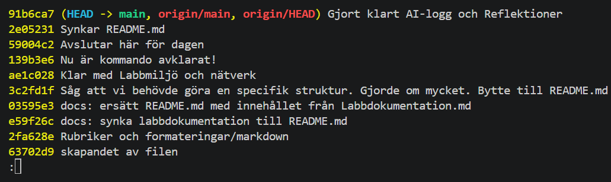

# <ins>**Labbmiljö, Git, CLI och AI**</ins>
## 1. Titel & Introduktion
- **Kurs:** Introduktion till yrkesrollen och grunderna i IT-infrastruktur (MYH 2025/4008)
- **Student:** Joakim Tran
- **Datum:** 2026-09-22
- **Beskrivning av labben:** Vi ska redovisa vår kunskap och problemlösning som visas upp på labbmiljöerna och uppgifter. Första är att vi uppgör en teknisk dokumentation som ska fullfölja dokumentationens/uppgiftens hänvisningar

## 2. Labbmiljö & Nätverk (Kursmål 8)
### Felsökning
Windows 11 har oftast standard att inte tillåta ping/ICMP in till sig själv men ut går bra. Fick köra kommandot "netsh advfirewall firewall add rule name="Let ping in" protocol=icmpv4:any,any dir=in action=allow"<sup>1</sup> i CMD

### VMs och nätverk
| Hostname                     | Operativsystem     | IP-adress       | Subnätmask    | Standard Gateway |
| ---------------------------- | ------------------ | --------------- | ------------- | ---------------- |
| Chas                         | Windows 11         | 192.168.136.128 | 255.255.255.0 | 192.168.136.1    |
| Chas-VMware-Virtual-Platform | Ubuntu 26.04.1 LTS | 192.168.136.129 | 255.255.255.0 | 192.168.136.1    |

#### PING/ICMP
##### Ubuntu -> Windows
```
chas@chas-VMware-Virtual-Platform:~$ ping -c 4 192.168.136.128
PING 192.168.136.128 (192.168.136.128) 56(84) bytes of data.
64 bytes from 192.168.136.128: icmp_seq=1 ttl=128 time=0.482 ms
64 bytes from 192.168.136.128: icmp_seq=2 ttl=128 time=0.452 ms
64 bytes from 192.168.136.128: icmp_seq=3 ttl=128 time=0.417 ms
64 bytes from 192.168.136.128: icmp_seq=4 ttl=128 time=0.511 ms

--- 192.168.136.128 ping statistics ---
4 packets transmitted, 4 received, 0% packet loss, time 3092ms
rtt min/avg/max/mdev = 0.417/0.465/0.511/0.034 ms
```
##### Windows -> Ubuntu
```
Microsoft Windows [Version 10.0.26200.9168]
(c) Microsoft Corporation. Med ensamrätt.

C:\Users\Chassy>ping 192.168.136.129

Pinging 192.168.136.129 with 32 bytes of data:
Reply from 192.168.136.129: bytes=32 time<1ms TTL=64
Reply from 192.168.136.129: bytes=32 time<1ms TTL=64
Reply from 192.168.136.129: bytes=32 time<1ms TTL=64
Reply from 192.168.136.129: bytes=32 time<1ms TTL=64

Ping statistics for 192.168.136.129:
    Packets: Sent = 4, Received = 4, Lost = 0 (0% loss),
Approximate round trip times in milli-seconds:
    Minimum = 0ms, Maximum = 0ms, Average = 0ms
```
## 3. Kommandoradsgenomförande (Kursmål 9)
##### Linux/Ubuntu
```
chas@chas-VMware-Virtual-Platform:~$ sudo mkdir -p /var/systementor/konsultdata
chas@chas-VMware-Virtual-Platform:~$ cd /var/systementor/konsultdata
chas@chas-VMware-Virtual-Platform:/var/systementor/konsultdata$ sudo touch anteckningar.txt
chas@chas-VMware-Virtual-Platform:/var/systementor/konsultdata$ sudo groupadd konsulter
chas@chas-VMware-Virtual-Platform:/var/systementor/konsultdata$ sudo chown -R root:konsulter /var/systementor/konsultdata
chas@chas-VMware-Virtual-Platform:/var/systementor/konsultdata$ sudo chmod 750 /var/systementor/konsultdata
chas@chas-VMware-Virtual-Platform:/var/systementor/konsultdata$ sudo chmod 640 anteckningar.txt
chas@chas-VMware-Virtual-Platform:/var/systementor/konsultdata$ sudo ls -la
total 8
drwxr-x--- 2 root konsulter 4096 Sep 22 20:05 .
drwxr-xr-x 3 root root      4096 Sep 22 20:04 ..
-rw-r----- 1 root konsulter    0 Sep 22 20:05 anteckningar.txt
chas@chas-VMware-Virtual-Platform:/var/systementor/konsultdata$ ip addr show
1: lo: <LOOPBACK,UP,LOWER_UP> mtu 65536 qdisc noqueue state UNKNOWN group default qlen 1000
    link/loopback 00:00:00:00:00:00 brd 00:00:00:00:00:00
    inet 127.0.0.1/8 scope host lo
       valid_lft forever preferred_lft forever
    inet6 ::1/128 scope host noprefixroute 
       valid_lft forever preferred_lft forever
2: ens33: <BROADCAST,MULTICAST,UP,LOWER_UP> mtu 1500 qdisc fq_codel state UP group default qlen 1000
    link/ether 00:0c:29:63:b9:43 brd ff:ff:ff:ff:ff:ff
    inet 192.168.136.129/24 brd 192.168.136.255 scope global dynamic noprefixroute ens33
       valid_lft 1180sec preferred_lft 1180sec
chas@chas-VMware-Virtual-Platform:/var/systementor/konsultdata$ ping -c 4 192.168.136.128
PING 192.168.136.128 (192.168.136.128) 56(84) bytes of data.
64 bytes from 192.168.136.128: icmp_seq=1 ttl=128 time=0.987 ms
64 bytes from 192.168.136.128: icmp_seq=2 ttl=128 time=0.345 ms
64 bytes from 192.168.136.128: icmp_seq=3 ttl=128 time=0.500 ms
64 bytes from 192.168.136.128: icmp_seq=4 ttl=128 time=0.695 ms

--- 192.168.136.128 ping statistics ---
4 packets transmitted, 4 received, 0% packet loss, time 3079ms
rtt min/avg/max/mdev = 0.345/0.631/0.987/0.239 ms
```
##### Windows 11
###### CMD
```
C:\Users\Chassy>mkdir C:\Systementor\KonsultData
C:\Users\Chassy>ipconfig /all

Windows IP Configuration

   Host Name . . . . . . . . . . . . : Chas
   Primary Dns Suffix  . . . . . . . :
   Node Type . . . . . . . . . . . . : Hybrid
   IP Routing Enabled. . . . . . . . : No
   WINS Proxy Enabled. . . . . . . . : No

Ethernet adapter Ethernet0:

   Connection-specific DNS Suffix  . : localdomain
   Description . . . . . . . . . . . : Intel(R) 82574L Gigabit Network Connection
   Physical Address. . . . . . . . . : 00-0C-29-F4-73-AE
   DHCP Enabled. . . . . . . . . . . : Yes
   Autoconfiguration Enabled . . . . : Yes
   Link-local IPv6 Address . . . . . : fe80::f905:e3fa:669c:b41d%10(Preferred)
   IPv4 Address. . . . . . . . . . . : 192.168.136.128(Preferred)
   Subnet Mask . . . . . . . . . . . : 255.255.255.0
   Lease Obtained. . . . . . . . . . : den 22 september 2026 20:11:06
   Lease Expires . . . . . . . . . . : den 22 september 2026 20:56:06
   Default Gateway . . . . . . . . . :
   DHCP Server . . . . . . . . . . . : 192.168.136.254
   DHCPv6 IAID . . . . . . . . . . . : 83889193
   DHCPv6 Client DUID. . . . . . . . : 00-01-01-00-32-28-DD-AF-00-0C-29-F4-73-AE
   DNS Servers . . . . . . . . . . . : 192.168.136.1
   NetBIOS over Tcpip. . . . . . . . : Enabled
C:\Users\Chassy>ping 192.168.136.129

Pinging 192.168.136.129 with 32 bytes of data:
Reply from 192.168.136.129: bytes=32 time<1ms TTL=64
Reply from 192.168.136.129: bytes=32 time<1ms TTL=64
Reply from 192.168.136.129: bytes=32 time<1ms TTL=64
Reply from 192.168.136.129: bytes=32 time<1ms TTL=64

Ping statistics for 192.168.136.129:
    Packets: Sent = 4, Received = 4, Lost = 0 (0% loss),
Approximate round trip times in milli-seconds:
    Minimum = 0ms, Maximum = 0ms, Average = 0ms
```
###### Powershell
```
PS C:\WINDOWS\system32> Get-Acl -Path "C:\Systementor\KonsultData" | Format-List


Path   : Microsoft.PowerShell.Core\FileSystem::C:\Systementor\KonsultData
Owner  : Chas\Chassy
Group  : Chas\Ingen
Access : BUILTIN\Administratörer Allow  FullControl
         NT instans\SYSTEM Allow  FullControl
         BUILTIN\Användare Allow  ReadAndExecute, Synchronize
         NT instans\Autentiserade användare Allow  Modify, Synchronize
         NT instans\Autentiserade användare Allow  -536805376
Audit  :
Sddl   : O:S-1-5-21-4132158795-2060570990-1823972835-1001G:S-1-5-21-4132158795-2060570990-1823972835-513D:AI(A;OICIID;F
         A;;;BA)(A;OICIID;FA;;;SY)(A;OICIID;0x1200a9;;;BU)(A;ID;0x1301bf;;;AU)(A;OICIIOID;SDGXGWGR;;;AU)


```
## 4. Git & Versionshantering (Kursmål 10)

## [<ins> ***Länk till uppgiften/labben*** </ins>](https://github.com/Soroeze/labb-git)

```
PS C:\Users\Frostgrim\labb-git> git log --oneline
91b6ca7 (HEAD -> main, origin/main, origin/HEAD) Gjort klart AI-logg och Reflektioner
2e05231 Synkar README.md
59004c2 Avslutar här för dagen
139b3e6 Nu är kommando avklarat!
ae1c028 Klar med Labbmiljö och nätverk
3c2fd1f Såg att vi behövde göra en specifik struktur. Gjorde om mycket. Bytte till README.md
03595e3 docs: ersätt README.md med innehållet från Labbdokumentation.md
e59f26c docs: synka labbdokumentation till README.md
2fa628e Rubriker och formateringar/markdown
:
```

## 5. AI-logg & Reflektion (Kursmål 11)
### Förtext
***Jag kör på "tillfällig" eller inkognito-session på Gemini AI för att utesluta minne eller personliga referenser.***
#### Prompt och svar

##### Prompt
```
Prompt/Jag:
"Hej! Jag håller på att sätta upp en Ubuntu-server för ett konsultbolag. 

Jag behöver skapa mappen /var/systementor/konsultdata och i den ska det ligga en tom fil som heter anteckningar.txt. Jag har även en lokal användargrupp som heter konsulter.

Hur konfigurerar jag katalog, fil, ägarskap och rättigheter i Linux så att konsulterna kan navigera i mappen och läsa anteckningarna utan att få "permission denied"? Ge mig de exakta terminalkommandona och förklara hur rättigheterna fungerar."
```
##### Svar
```
Gemini AI:
"1. Terminalkommandon

Kör följande kommandon i terminalen med sudo:
Steg 1: Skapa katalogstrukturen

Flaggan -p ser till att hela sökvägen skapas om inte /var/systementor redan finns:
Bash

sudo mkdir -p /var/systementor/konsultdata

Steg 2: Skapa anteckningsfilen
Bash

sudo touch /var/systementor/konsultdata/anteckningar.txt

Steg 3: Sätt ägarskap till gruppen konsulter

Sätt root som ägare och konsulter som ägande grupp rekursivt:
Bash

sudo chown -R root:konsulter /var/systementor/konsultdata

Steg 4: Konfigurera katalogrättigheter (750)

Ger ägaren full åtkomst, gruppen rätt att gå in i och lista mappen, samt stänger ute övriga:
Bash

sudo chmod 750 /var/systementor/konsultdata

Steg 5: Konfigurera filrättigheter (640)

Ger ägaren läs- och skrivrätt, gruppen enbart läsrätt, och övriga ingen åtkomst:
Bash

sudo chmod 640 /var/systementor/konsultdata/anteckningar.txt

2. Rättighetsöversikt

Linux använder tre segment för behörigheter: User (Ägare), Group (Grupp) och Others (Övriga).
Numerisk beräkning (Oktala värden)

    Läs (r) = 4

    Skriv (w) = 2

    Kör/Exekvera (x) = 1

Värdena summeras per nivå:
Resurs	Värde	Symboliskt	Ägare (root)	Grupp (konsulter)	Övriga (others)
/var/systementor/konsultdata	750	drwxr-x---	rwx (7)	r-x (5)	--- (0)
anteckningar.txt	640	-rw-r-----	rw- (6)	r-- (4)	--- (0)
3. Varför uppstår "Permission Denied"?

Att användare inte kan navigera beror oftast på skillnaden mellan hur rättigheter tolkas på filer kontra kataloger:

    På en fil:

        r ger tillåtelse att läsa filens innehåll (t.ex. cat anteckningar.txt).

        w ger tillåtelse att ändra innehållet.

        x gör filen körbar som ett program/skript (ska inte sättas på vanliga textfiler).

    På en katalog:

        r ger tillåtelse att lista innehållet (ls).

        x (traverseringsbiten) krävs för att kunna gå in i mappen (cd), läsa filattribut samt öppna filer som ligger inuti mappen.

        Utan x på mappen får användaren Permission denied direkt vid försök att navigera in i den, även om själva filen har läsrättigheter.

    Viktigt: Föräldramappen /var/systementor måste också ha minst x-behörighet (t.ex. 755) för att systemet ska tillåta användare att traversera hela vägen ned till konsultdata.

4. Verifiering

Kontrollera att ägarskap och rättigheter applicerats korrekt:
Bash

# Kontrollera katalogen
ls -ld /var/systementor/konsultdata

# Kontrollera filen
ls -l /var/systementor/konsultdata/anteckningar.txt

Förväntat utfall:
Plaintext

drwxr-x--- 2 root konsulter 4096 Sep 23 21:00 /var/systementor/konsultdata
-rw-r----- 1 root konsulter    0 Sep 23 21:00 /var/systementor/konsultdata/anteckningar.txt"
```

### Analys av AI och reflektioner
Var vänligen att hänvisa tillbaka till [prompt och svar](#prompt-och-svar) om det behövs.

Jag testade att köra prompt som vi har gjort föregående på [Kommandoradsgenomförande](#3-kommandoradsgenomförande-kursmål-9). Där vi satte rättigheter, mappar och filer för gruppen "konsulter".
Hittills så är Gemini AI korrekt och den förklarar bra. 
Väldigt ofta så "ändras" eller uppdateras inte kommando eller kod om det inte är för en säkerhetsrisk eller dylik anledning t.ex. undvika SQL Injection.
Kommandon som Gemini AI stämmer bra överens med hur det ser ut på [Kommandoradsgenomförande](#3-kommandoradsgenomförande-kursmål-9). Alltså hur det kan se ut när man utövar "Least-Privilige".
Vi kan jämföra kommandon jag har utfört gentemot Gemini AI.

##### Jag

```
chas@chas-VMware-Virtual-Platform:~$ sudo mkdir -p /var/systementor/konsultdata
chas@chas-VMware-Virtual-Platform:~$ cd /var/systementor/konsultdata
chas@chas-VMware-Virtual-Platform:/var/systementor/konsultdata$ sudo touch anteckningar.txt
chas@chas-VMware-Virtual-Platform:/var/systementor/konsultdata$ sudo groupadd konsulter
chas@chas-VMware-Virtual-Platform:/var/systementor/konsultdata$ sudo chown -R root:konsulter /var/systementor/konsultdata
chas@chas-VMware-Virtual-Platform:/var/systementor/konsultdata$ sudo chmod 750 /var/systementor/konsultdata
chas@chas-VMware-Virtual-Platform:/var/systementor/konsultdata$ sudo chmod 640 anteckningar.txt
chas@chas-VMware-Virtual-Platform:/var/systementor/konsultdata$ sudo ls -la
drwxr-x--- 2 root konsulter 4096 Sep 22 20:05 .
drwxr-xr-x 3 root root      4096 Sep 22 20:04 ..
-rw-r----- 1 root konsulter    0 Sep 22 20:05 anteckningar.txt
```

##### Gemini AI
```
drwxr-x--- 2 root konsulter 4096 Sep 23 21:00 /var/systementor/konsultdata
-rw-r----- 1 root konsulter    0 Sep 23 21:00 /var/systementor/konsultdata/anteckningar.txt
```

Som sagt, ganska nära men allt beror ju på hur man skriver för argument på angivna kommando. 
Jag använde "ls -la" och Gemini AI använde "ls -ld" och "ls" för att hålla det kort, lätt och förståeligt för mäniskliga ögon.
Så vi kan avsluta med att säga att det verkar inte visa några hallucinationer, föråldrade kod/kommando och inte heller några säkerhetsbrister. Men det är också grundläggande koder och kommandon.